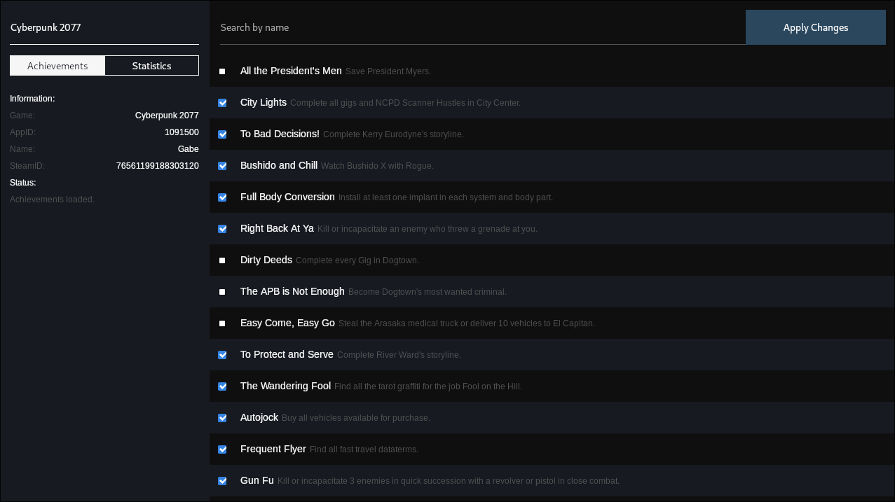

# Samira

A steam achievement manager for linux

## Description
Samira is a desktop application that allows you to unlock achievements and set statistics. This project is a work in progress and has only been tested on arch based distributions and Ubuntu 24.04. The long term goal of this project is to recreate all features of the original [SAM](https://github.com/gibbed/SteamAchievementManager) on Linux, Windows, and MacOS. 

Steam Flatpak is not currently supported. 

## Installation
AppImage and .deb file can be found [here](https://github.com/jsnli/Samira/releases).

The project is still in pre-release. Any issues and feedback is appreciated.

