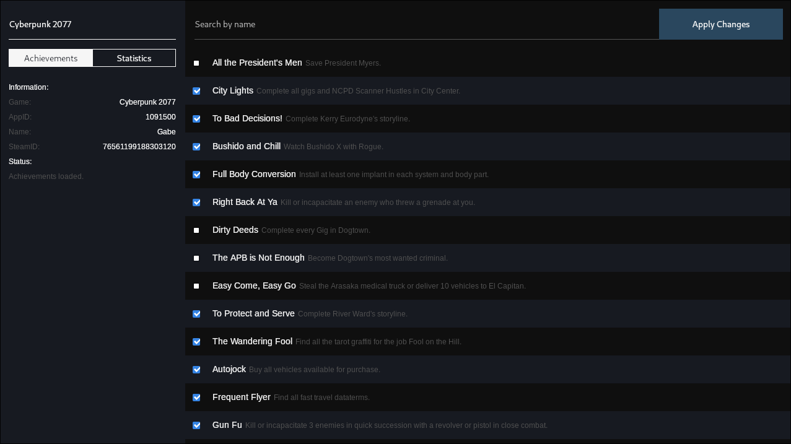

<div align="right">
  <details>
    <summary >🌐 Language</summary>
    <div>
      <div align="center">
        <a href="https://openaitx.github.io/view.html?user=jsnli&project=Samira&lang=en">English</a>
        | <a href="https://openaitx.github.io/view.html?user=jsnli&project=Samira&lang=zh-CN">简体中文</a>
        | <a href="https://openaitx.github.io/view.html?user=jsnli&project=Samira&lang=zh-TW">繁體中文</a>
        | <a href="https://openaitx.github.io/view.html?user=jsnli&project=Samira&lang=ja">日本語</a>
        | <a href="https://openaitx.github.io/view.html?user=jsnli&project=Samira&lang=ko">한국어</a>
        | <a href="https://openaitx.github.io/view.html?user=jsnli&project=Samira&lang=hi">हिन्दी</a>
        | <a href="https://openaitx.github.io/view.html?user=jsnli&project=Samira&lang=th">ไทย</a>
        | <a href="https://openaitx.github.io/view.html?user=jsnli&project=Samira&lang=fr">Français</a>
        | <a href="https://openaitx.github.io/view.html?user=jsnli&project=Samira&lang=de">Deutsch</a>
        | <a href="https://openaitx.github.io/view.html?user=jsnli&project=Samira&lang=es">Español</a>
        | <a href="https://openaitx.github.io/view.html?user=jsnli&project=Samira&lang=it">Italiano</a>
        | <a href="https://openaitx.github.io/view.html?user=jsnli&project=Samira&lang=ru">Русский</a>
        | <a href="https://openaitx.github.io/view.html?user=jsnli&project=Samira&lang=pt">Português</a>
        | <a href="https://openaitx.github.io/view.html?user=jsnli&project=Samira&lang=nl">Nederlands</a>
        | <a href="https://openaitx.github.io/view.html?user=jsnli&project=Samira&lang=pl">Polski</a>
        | <a href="https://openaitx.github.io/view.html?user=jsnli&project=Samira&lang=ar">العربية</a>
        | <a href="https://openaitx.github.io/view.html?user=jsnli&project=Samira&lang=fa">فارسی</a>
        | <a href="https://openaitx.github.io/view.html?user=jsnli&project=Samira&lang=tr">Türkçe</a>
        | <a href="https://openaitx.github.io/view.html?user=jsnli&project=Samira&lang=vi">Tiếng Việt</a>
        | <a href="https://openaitx.github.io/view.html?user=jsnli&project=Samira&lang=id">Bahasa Indonesia</a>
        | <a href="https://openaitx.github.io/view.html?user=jsnli&project=Samira&lang=as">অসমীয়া</
      </div>
    </div>
  </details>
</div>

# Samira

A Steam Achievement Manager for Linux



## Description
Samira is a desktop application that allows you to unlock achievements and set statistics.  

## Installation and Usage
Releases can be found [here](https://github.com/jsnli/Samira/releases).

Steam must be running and the user must be logged in.

Flatpak is not supported. Steam must be installed through your distribution's package manager or through the installer from the official [steam page](https://store.steampowered.com/about/).

## Building

To build this project you'll need the [prerequisites](https://tauri.app/start/prerequisites/) for Tauri as well as Rust, Node, and npm.

Clone the repository and install: 
```
cd Samira && npm install
```

Tauri does not automatically set library search paths. This is a known issue in Tauri and until an official fix is available we need to set it ourselves: 
```
export LD_LIBRARY_PATH=$LD_LIBRARY_PATH:/usr/lib/libsteam_api.so
```

The `libsteam_api.so` file is available in `/assets/`.

**Dev**
```
npm run tauri dev
```

**Build**
```
npm run tauri build
```

On Arch based distributions, a bundling error may occur due to Tauri and linuxdeploy using the wrong `strip` binary. A workaround is available:
```
NO_STRIP=true npm run tauri build
```

## Contributing
Like its predecessors, Samira is open source and open to contributions. Please feel free to ask questions, open pull requests, and raise issues.
