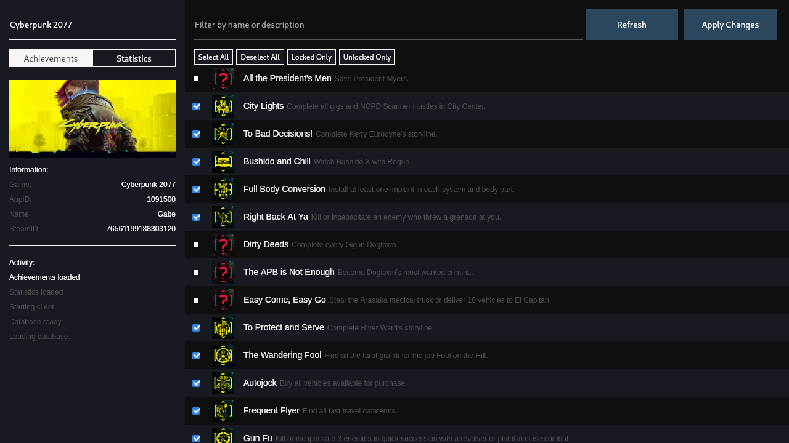

# Samira

A steam achievement manager for linux



## Description
Samira is a desktop application that allows you to unlock achievements and set statistics. The long term goal of this project is to recreate all features of the original [SAM](https://github.com/gibbed/SteamAchievementManager) on Linux, Windows, and MacOS. 

Steam Flatpak is not currently supported. 

## Installation and Usage
AppImage and .deb file can be found [here](https://github.com/jsnli/Samira/releases).

Steam must be running and the user must be logged in.

Flatpak is not currently supported. Steam must be installed through your distribution's package manager or through the installer from the official [steam page](https://store.steampowered.com/about/).

## Building

To build this project you'll need the [prerequisites](https://tauri.app/start/prerequisites/) for Tauri as well as Rust, Node, and npm.

Clone the repository and install: 
```
cd Samira && npm install
```

Tauri does not automatically set library search paths. This is a known issue in Tauri and until an official fix is available we need to set it ourselves: 
```
export LD_LIBRARY_PATH=$LD_LIBRARY_PATH:/usr/lib/libsteam_api.so
```

The `libsteam_api.so` file is available in `/assets/`.

**Dev**
```
npm run tauri dev
```

**Build**
```
npm run tauri build
```

On arch based distributions, a bundling error may occur due to Tauri and linuxdeploy using the wrong `strip` binary. A workaround is available:
```
NO_STRIP=true npm run tauri build
```


